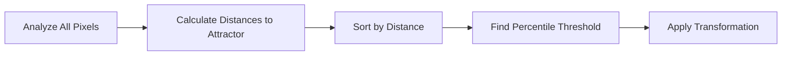

# Chapter 3: Basic Usage

This chapter provides a comprehensive understanding of imgcolorshine's core concepts, building on the quick start to give you mastery over the fundamental features.

## The Attractor Model Explained

imgcolorshine uses a unique "color attractor" approach inspired by physics. Instead of replacing colors, attractors **pull** existing colors toward them, creating natural, organic transformations.

### Physics Analogy

Think of color attractors like gravitational fields:

- **Attractor Color:** The "planet" that exerts gravitational pull
- **Tolerance:** The radius of the gravitational field  
- **Strength:** The intensity of the gravitational force
- **Image Colors:** The "objects" being pulled through color space

This results in smooth, gradual transitions rather than harsh replacements.

### Why This Approach Works

1. **Natural Transitions:** Colors smoothly blend rather than abruptly change
2. **Preserves Relationships:** Color harmony is maintained
3. **Adaptive to Content:** Works differently on each image's unique palette
4. **Intuitive Control:** Parameters behave predictably

## Deep Dive: Tolerance Parameter

Tolerance is perhaps the most important parameter to understand. It's **not** a fixed radius but a **percentile-based system**.

### How Tolerance Works



#### Step-by-Step Process

1. **Distance Calculation:** Every pixel's perceptual distance to the attractor is calculated in OKLCH space
2. **Sorting:** All distances are sorted from closest to furthest
3. **Percentile Selection:** The tolerance percentage determines the cutoff
4. **Transformation:** Only pixels within this threshold are affected

### Tolerance Examples

Let's examine how tolerance affects the same blue attractor on different images:

=== "Colorful Image"
    ```bash
    # Vibrant image with many colors
    imgcolorshine shine colorful.jpg "blue;30;70"
    # Only pixels already close to blue are affected
    ```

=== "Monochrome Image"
    ```bash
    # Black and white image  
    imgcolorshine shine bw.jpg "blue;30;70"
    # 30% of pixels closest to blue (even if far) are affected
    ```

=== "Blue-Heavy Image"
    ```bash
    # Image with lots of blue tones
    imgcolorshine shine sky.jpg "blue;30;70"
    # Many similar pixels, tight selection
    ```

### Tolerance Guidelines

| Tolerance Range | Effect | Best Use Cases |
|-----------------|--------|----------------|
| **5-20** | Very selective, only near-exact matches | Fine-tuning specific colors |
| **25-45** | Moderate selection, similar tones | Targeted color correction |
| **50-70** | Balanced influence, natural look | General color grading |
| **75-90** | Broad influence, dramatic changes | Artistic effects |
| **95-100** | Nearly all pixels affected | Extreme stylization |

## Deep Dive: Strength Parameter

Strength controls the intensity of the color pull, with different behaviors in different ranges.

### Strength Ranges

#### Normal Range (0-100)
Standard falloff behavior where closer pixels are pulled harder:

```bash
# Subtle enhancement
imgcolorshine shine photo.jpg "orange;50;30"

# Natural transformation  
imgcolorshine shine photo.jpg "orange;50;70"

# Strong but realistic
imgcolorshine shine photo.jpg "orange;50;100"
```

#### Extended Range (101-200)
Progressively flattens the falloff curve for more uniform effects:

```bash
# Slight flattening
imgcolorshine shine photo.jpg "orange;50;110"

# More uniform transformation
imgcolorshine shine photo.jpg "orange;50;150"

# Complete uniformity (duotone-like)
imgcolorshine shine photo.jpg "orange;50;200"
```

### Strength Visualization

The falloff curve changes based on strength:

- **Strength 50:** Smooth gradient from full effect to no effect
- **Strength 100:** Steeper gradient, full effect at center
- **Strength 150:** Flattened gradient, more uniform transformation
- **Strength 200:** No gradient, uniform transformation within tolerance

## Color Format Deep Dive

imgcolorshine accepts any CSS color format, but some are more intuitive for color grading work.

### Recommended: OKLCH Format

OKLCH is the native color space, so values are used directly:

```bash
# Lightness: 70%, Chroma: 0.15, Hue: 30 degrees
imgcolorshine shine image.jpg "oklch(70% 0.15 30);50;70"
```

**OKLCH Components:**
- **L (Lightness):** 0-100%, perceptual brightness
- **C (Chroma):** 0-0.4+, colorfulness/saturation  
- **H (Hue):** 0-360°, color angle (0=red, 120=green, 240=blue)

### Working with Different Formats

=== "Named Colors"
    ```bash
    # Simple and intuitive
    imgcolorshine shine image.jpg "coral;50;70"
    imgcolorshine shine image.jpg "steelblue;60;80"
    ```
    **Pros:** Easy to remember, descriptive
    **Cons:** Limited selection, imprecise

=== "Hex Colors"
    ```bash
    # Precise RGB values
    imgcolorshine shine image.jpg "#ff6b47;50;70"
    imgcolorshine shine image.jpg "#4682b4;60;80"
    ```
    **Pros:** Precise, widely used
    **Cons:** Not perceptually uniform

=== "HSL Colors"
    ```bash
    # Intuitive for traditional color work
    imgcolorshine shine image.jpg "hsl(15, 100%, 65%);50;70"
    imgcolorshine shine image.jpg "hsl(207, 44%, 49%);60;80"
    ```
    **Pros:** Familiar to designers
    **Cons:** Not perceptually uniform

## Channel Control Fundamentals

imgcolorshine allows independent control over Lightness (L), Chroma (C), and Hue (H) channels.

### Understanding the Channels

#### Lightness (L)
Perceptual brightness of the color:
```bash
# Only affect brightness, preserve color
imgcolorshine shine dark_image.jpg "white;70;60" \
  --saturation=False --hue=False
```

#### Chroma (C) / Saturation
Colorfulness or intensity:
```bash
# Only affect saturation, preserve hue and lightness
imgcolorshine shine dull_image.jpg "red;60;80" \
  --luminance=False --hue=False
```

#### Hue (H)
The actual color (red, blue, green, etc.):
```bash
# Only shift colors, preserve brightness and saturation
imgcolorshine shine image.jpg "blue;50;70" \
  --luminance=False --saturation=False
```

### Channel Combination Strategies

=== "Warm/Cool Adjustment"
    ```bash
    # Shift hue toward warm without changing exposure
    imgcolorshine shine photo.jpg "orange;60;50" \
      --luminance=False --saturation=False
    ```

=== "Exposure Correction"
    ```bash
    # Brighten shadows without color shift
    imgcolorshine shine underexposed.jpg "white;80;60" \
      --saturation=False --hue=False
    ```

=== "Saturation Boost"
    ```bash
    # Enhance vibrancy without hue/exposure changes
    imgcolorshine shine flat_image.jpg "red;70;80" \
      --luminance=False --hue=False
    ```

## Multiple Attractor Fundamentals

When using multiple attractors, imgcolorshine blends their influences using weighted averages.

### Blending Behavior

The transformation for each pixel is:
```
Final_Color = (W₀ × Original) + (W₁ × Attractor₁) + (W₂ × Attractor₂) + ...
```

Where weights are normalized to sum to 1.0.

### Strategic Attractor Placement

#### Complementary Colors
```bash
# Teal/orange cinematic look
imgcolorshine shine image.jpg \
  "teal;40;60" \
  "orange;40;60"
```

#### Highlight/Shadow Split
```bash
# Cool shadows, warm highlights
imgcolorshine shine image.jpg \
  "oklch(30% 0.1 240);60;70" \
  "oklch(80% 0.1 60);60;70"
```

#### Color Grading Zones
```bash
# Three-way color correction
imgcolorshine shine image.jpg \
  "oklch(20% 0.05 240);30;50" \    # Shadows: cool
  "oklch(50% 0.03 30);30;40" \     # Midtones: neutral warm
  "oklch(85% 0.08 60);30;60"       # Highlights: warm
```

## Practical Workflow Patterns

### Iterative Refinement

Start conservative and build up:

```bash
# Step 1: Subtle test
imgcolorshine shine original.jpg "blue;30;40" --output_image=test1.jpg

# Step 2: Increase if needed
imgcolorshine shine original.jpg "blue;50;60" --output_image=test2.jpg

# Step 3: Fine-tune
imgcolorshine shine original.jpg "blue;45;55" --output_image=final.jpg
```

### A/B Comparison Workflow

```bash
# Create variations for comparison
imgcolorshine shine base.jpg "warm;50;60" --output_image=warm.jpg
imgcolorshine shine base.jpg "cool;50;60" --output_image=cool.jpg
imgcolorshine shine base.jpg "neutral;50;60" --output_image=neutral.jpg

# Use image viewer to compare side-by-side
```

### Progressive Enhancement

Build complex looks step by step:

```bash
# Step 1: Base color temperature
imgcolorshine shine original.jpg "oklch(70% 0.05 50);70;50" \
  --output_image=step1.jpg

# Step 2: Add saturation to specific colors
imgcolorshine shine step1.jpg "red;40;70" \
  --luminance=False --hue=False --output_image=step2.jpg

# Step 3: Fine-tune shadows
imgcolorshine shine step2.jpg "oklch(30% 0.08 240);40;60" \
  --output_image=final.jpg
```

## Output Management

### Naming Conventions

Develop a systematic naming approach:

```bash
# Include parameters in filename
imgcolorshine shine portrait.jpg "orange;50;70" \
  --output_image=portrait_orange_50_70.jpg

# Include effect description
imgcolorshine shine landscape.jpg "blue;60;80" \
  --output_image=landscape_cool_dramatic.jpg

# Version numbering
imgcolorshine shine photo.jpg "red;45;65" \
  --output_image=photo_v01_red_grading.jpg
```

### Quality Preservation

imgcolorshine preserves image quality:
- No additional compression artifacts
- Full bit depth maintained
- Original resolution preserved
- Professional color space handling

## Error Prevention and Recovery

### Common Parameter Mistakes

#### Invalid Color Values
```bash
# ❌ Will fail
imgcolorshine shine image.jpg "not-a-color;50;70"

# ✅ Use valid CSS colors
imgcolorshine shine image.jpg "forestgreen;50;70"
```

#### Out-of-Range Values
```bash
# ❌ Invalid ranges
imgcolorshine shine image.jpg "red;150;70"  # tolerance > 100
imgcolorshine shine image.jpg "red;50;-10" # negative strength

# ✅ Valid ranges
imgcolorshine shine image.jpg "red;50;70"  # tolerance: 0-100, strength: 0-200
```

### Recovery Strategies

If results are unexpected:

1. **Check original:** Ensure input image is correct
2. **Simplify:** Try single attractor with moderate values
3. **Isolate:** Test each channel separately
4. **Verbose mode:** Add `--verbose=True` for diagnostics

## Advanced Parameter Relationships

### Tolerance-Strength Interactions

Different combinations create different effects:

| Tolerance | Strength | Effect |
|-----------|----------|--------|
| Low + Low | Subtle spot corrections |
| Low + High | Precise dramatic changes |
| High + Low | Gentle overall shifts |
| High + High | Strong stylization |

### Multi-Attractor Balance

When using multiple attractors:
- **Equal strength:** Balanced blending
- **Varied strength:** Dominant/accent relationship
- **Overlapping tolerance:** Smooth transitions
- **Distinct tolerance:** Zoned effects

## Next Steps

With these fundamentals mastered, you're ready for:

1. **[Understanding Attractors](understanding-attractors.md)** - The physics and math behind the model
2. **[Advanced Features](advanced-features.md)** - Complex techniques and workflows
3. **[Color Science](color-science.md)** - The perceptual color theory

!!! tip "Practice Recommendation"
    Try the same transformation on 5-10 different images to understand how the adaptive tolerance system responds to various color palettes.