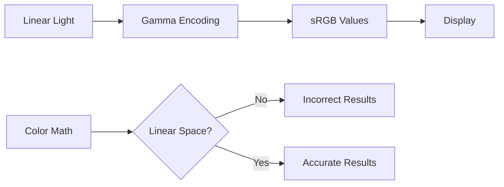
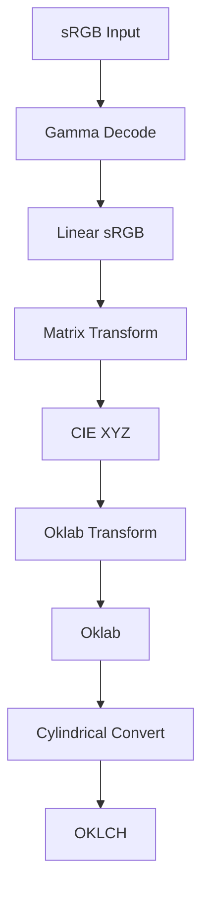
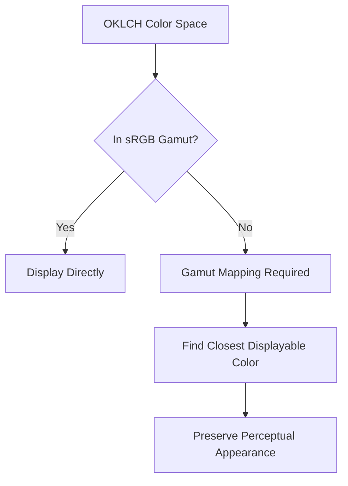

# Chapter 7: Color Science

This chapter explores the mathematical and perceptual foundations that make imgcolorshine's color transformations accurate, intuitive, and visually pleasing.

## The Problem with RGB

Traditional RGB color spaces create significant challenges for perceptual color work.

### RGB Limitations

#### Non-Uniform Perceptual Distance

In RGB space, equal numerical differences don't correspond to equal perceived differences:

```python
# These RGB differences are numerically equal
color1 = (100, 0, 0)    # Dark red
color2 = (150, 0, 0)    # Medium red
diff1 = 50              # Perceptually large difference

color3 = (200, 0, 0)    # Bright red  
color4 = (250, 0, 0)    # Very bright red
diff2 = 50              # Perceptually small difference
```

This means RGB distance calculations fail to match human perception.

#### Gamma Encoding Issues

sRGB uses gamma encoding for display optimization, but this creates non-linear relationships:



#### Device Dependence

RGB values depend on the specific display device:
- Different color gamuts
- Varying white points
- Inconsistent color reproduction

## The OKLCH Solution

OKLCH (OK Lightness Chroma Hue) solves RGB's perceptual problems through careful mathematical design.

### OKLCH Color Space Structure

OKLCH is the cylindrical representation of Oklab, designed for intuitive manipulation:

```
L = Lightness (0-100%)
C = Chroma (0-0.4+)  
H = Hue (0-360°)
```

#### Lightness (L)
- **Range:** 0% (black) to 100% (white)
- **Perceptual:** Matches human brightness perception
- **Linear:** Equal steps appear equally spaced

#### Chroma (C)
- **Range:** 0 (gray) to ~0.4 (maximum saturation)
- **Meaning:** Distance from the neutral axis
- **Practical:** Higher values = more vivid colors

#### Hue (H)
- **Range:** 0-360° (circular)
- **Reference:** 0°=red, 120°=green, 240°=blue
- **Perceptual:** Equal angular differences appear equally spaced

### Conversion Pipeline

imgcolorshine uses a carefully calibrated conversion chain:



#### Mathematical Details

**sRGB to Linear sRGB:**
```
if sRGB ≤ 0.04045:
    linear = sRGB / 12.92
else:
    linear = ((sRGB + 0.055) / 1.055)^2.4
```

**Linear sRGB to XYZ:**
```
[X]   [0.4124 0.3576 0.1805] [R]
[Y] = [0.2126 0.7152 0.0722] [G]
[Z]   [0.0193 0.1192 0.9505] [B]
```

**XYZ to Oklab:**
```
l = ∛(0.8189330101 × X + 0.3618667424 × Y - 0.1288597137 × Z)
m = ∛(0.0329845436 × X + 0.9293118715 × Y + 0.0361456387 × Z)  
s = ∛(0.0482003018 × X + 0.2643662691 × Y + 0.6338517070 × Z)

L = 0.2104542553 × l + 0.7936177850 × m - 0.0040720468 × s
a = 1.9779984951 × l - 2.4285922050 × m + 0.4505937099 × s
b = 0.0259040371 × l + 0.7827717662 × m - 0.8086757660 × s
```

**Oklab to OKLCH:**
```
L = L (unchanged)
C = √(a² + b²)
H = atan2(b, a) × 180/π
```

## Perceptual Uniformity

The key advantage of OKLCH is perceptual uniformity: equal numerical distances correspond to equal perceived differences.

### Delta E in Oklab

Perceptual distance (ΔE) in Oklab space uses simple Euclidean distance:

```
ΔE = √[(L₁-L₂)² + (a₁-a₂)² + (b₁-b₂)²]
```

#### Perceptual Thresholds

| ΔE Value | Perceptual Difference |
|----------|----------------------|
| 0.0-1.0 | Just noticeable difference (JND) |
| 1.0-3.0 | Perceptible difference |
| 3.0-6.0 | Clearly visible difference |
| 6.0+ | Large, obvious difference |

This enables imgcolorshine's adaptive tolerance system to work consistently across all colors.

### Comparison with Other Spaces

=== "RGB Euclidean"
    ```python
    # Poor perceptual correlation
    def rgb_distance(c1, c2):
        return sqrt((c1[0]-c2[0])**2 + (c1[1]-c2[1])**2 + (c1[2]-c2[2])**2)
    ```

=== "CIE Lab ΔE*ab"
    ```python
    # Better than RGB, but not ideal
    def lab_delta_e(c1, c2):
        return sqrt((c1[0]-c2[0])**2 + (c1[1]-c2[1])**2 + (c1[2]-c2[2])**2)
    ```

=== "Oklab ΔE (Used)"
    ```python
    # Excellent perceptual correlation
    def oklab_delta_e(c1, c2):
        return sqrt((c1[0]-c2[0])**2 + (c1[1]-c2[1])**2 + (c1[2]-c2[2])**2)
    ```

## Gamut Mapping

Not all OKLCH colors can be displayed on sRGB monitors. imgcolorshine uses professional gamut mapping to handle out-of-gamut colors.

### The Gamut Problem



### CSS Color Module 4 Compliance

imgcolorshine implements the CSS Color Module 4 gamut mapping algorithm:

1. **Check Gamut:** Test if color is displayable
2. **Preserve Lightness:** Maintain L value if possible
3. **Preserve Hue:** Maintain H value if possible  
4. **Reduce Chroma:** Decrease C until color is in-gamut
5. **Optimize:** Find closest in-gamut color

#### Algorithm Implementation

```python
def gamut_map_oklch(L, C, H):
    # Convert to Oklab for processing
    a = C * cos(radians(H))
    b = C * sin(radians(H))
    
    # Binary search for maximum displayable chroma
    low_c, high_c = 0.0, C
    
    while (high_c - low_c) > TOLERANCE:
        test_c = (low_c + high_c) / 2
        test_a = test_c * cos(radians(H))
        test_b = test_c * sin(radians(H))
        
        if is_in_srgb_gamut(L, test_a, test_b):
            low_c = test_c
        else:
            high_c = test_c
    
    return L, low_c, H
```

### Gamut Mapping Strategies

#### Preserve Lightness and Hue
Default strategy for most use cases:
- Maintains color appearance
- Natural-looking results
- Minimal perceptual shift

#### Clip to Gamut Boundary
Alternative for extreme cases:
- Faster computation
- May introduce artifacts
- Used as fallback

#### Adaptive Strategies
Based on color characteristics:
- High-chroma colors: reduce chroma
- Near-neutral colors: slight hue adjustment acceptable
- Edge cases: multiple strategy testing

## Attractor Physics Model

imgcolorshine's attractor model is inspired by gravitational physics but adapted for perceptual color space.

### Gravitational Analogy

In physics, gravitational force follows:
```
F = G × (m₁ × m₂) / r²
```

imgcolorshine adapts this concept:
```
Influence = Strength × Falloff(Distance / Tolerance)
```

### Falloff Function Design

The raised cosine falloff function was chosen for optimal perceptual results:

```python
def falloff(normalized_distance):
    """
    Raised cosine falloff function
    
    Args:
        normalized_distance: 0.0 (at attractor) to 1.0 (at tolerance boundary)
    
    Returns:
        Influence weight: 1.0 (full) to 0.0 (none)
    """
    if normalized_distance >= 1.0:
        return 0.0
    
    return 0.5 * (cos(normalized_distance * π) + 1.0)
```

#### Why Raised Cosine?

1. **Smooth Transitions:** No discontinuities or sharp edges
2. **Natural Feel:** Mimics physical phenomena like light falloff
3. **Controllable Shape:** Single parameter controls transition character
4. **Mathematical Properties:** Differentiable, well-behaved

#### Comparison with Alternatives

=== "Linear Falloff"
    ```python
    falloff = 1.0 - d  # Too harsh, artificial-looking
    ```

=== "Quadratic Falloff"
    ```python
    falloff = (1.0 - d)**2  # Too aggressive near edges
    ```

=== "Gaussian Falloff"
    ```python
    falloff = exp(-d**2 / (2*sigma**2))  # No hard boundary
    ```

=== "Raised Cosine (Used)"
    ```python
    falloff = 0.5 * (cos(d * π) + 1.0)  # Optimal balance
    ```

### Extended Strength Mathematics

For strength values > 100, imgcolorshine modifies the falloff curve:

```python
def extended_strength_falloff(distance, strength):
    base_falloff = 0.5 * (cos(distance * π) + 1.0)
    
    if strength <= 100:
        return (strength / 100.0) * base_falloff
    else:
        # Progressive flattening
        base_weight = base_falloff
        extra_factor = (strength - 100.0) / 100.0
        return base_weight + extra_factor * (1.0 - base_weight)
```

At strength = 200, this produces uniform influence across the tolerance radius.

## Multi-Attractor Blending

When multiple attractors influence the same pixel, mathematical blending ensures smooth, predictable results.

### Weighted Average Blending

```python
def blend_colors(original_color, attractor_influences):
    """
    Blend multiple attractor influences using weighted averaging
    
    Args:
        original_color: [L, C, H] in OKLCH
        attractor_influences: [(weight, color), ...]
    
    Returns:
        Blended [L, C, H] color
    """
    total_weight = sum(weight for weight, _ in attractor_influences)
    source_weight = max(0.0, 1.0 - total_weight)
    
    # Start with original color contribution
    result_L = source_weight * original_color[0]
    result_C = source_weight * original_color[1]
    result_H_x = source_weight * cos(radians(original_color[2]))
    result_H_y = source_weight * sin(radians(original_color[2]))
    
    # Add attractor contributions
    for weight, attractor_color in attractor_influences:
        result_L += weight * attractor_color[0]
        result_C += weight * attractor_color[1]
        result_H_x += weight * cos(radians(attractor_color[2]))
        result_H_y += weight * sin(radians(attractor_color[2]))
    
    # Convert hue back to angle
    result_H = degrees(atan2(result_H_y, result_H_x))
    if result_H < 0:
        result_H += 360
    
    return [result_L, result_C, result_H]
```

### Circular Hue Averaging

Hue requires special handling due to its circular nature:

```python
# Problem: averaging 350° and 10° should give 0°, not 180°
wrong_average = (350 + 10) / 2  # = 180° (incorrect)

# Solution: convert to Cartesian coordinates
x1, y1 = cos(350°), sin(350°)
x2, y2 = cos(10°), sin(10°)
avg_x, avg_y = (x1 + x2) / 2, (y1 + y2) / 2
correct_average = atan2(avg_y, avg_x)  # ≈ 0° (correct)
```

## Numerical Stability and Precision

imgcolorshine implements several techniques to ensure numerical accuracy.

### Floating-Point Considerations

#### Precision Management
- **64-bit arithmetic:** For all color space conversions
- **32-bit processing:** For performance-critical kernels where appropriate
- **Range checking:** Prevent overflow/underflow conditions

#### Edge Case Handling

```python
def safe_atan2(y, x):
    """Numerically stable atan2 with proper edge case handling"""
    if abs(x) < EPSILON and abs(y) < EPSILON:
        return 0.0  # Undefined hue for achromatic colors
    return atan2(y, x)

def safe_sqrt(value):
    """Prevent negative square roots from floating-point errors"""
    return sqrt(max(0.0, value))
```

### Color Space Boundary Conditions

#### Chroma Limits
```python
def clamp_chroma(C):
    """Ensure chroma stays within physically meaningful bounds"""
    return max(0.0, min(C, MAX_CHROMA))
```

#### Lightness Bounds
```python
def clamp_lightness(L):
    """Ensure lightness stays within 0-100% range"""
    return max(0.0, min(100.0, L))
```

#### Hue Normalization
```python
def normalize_hue(H):
    """Normalize hue to 0-360° range"""
    return H % 360.0
```

## Validation and Testing

imgcolorshine includes comprehensive color science validation.

### Round-Trip Testing

Verify color space conversions are invertible:

```python
def test_roundtrip_conversion():
    for r, g, b in test_rgb_colors:
        # Forward conversion
        L, a, b_lab = srgb_to_oklab(r, g, b)
        L, C, H = oklab_to_oklch(L, a, b_lab)
        
        # Reverse conversion
        L2, a2, b2 = oklch_to_oklab(L, C, H)
        r2, g2, b2 = oklab_to_srgb(L2, a2, b2)
        
        # Verify accuracy
        assert abs(r - r2) < TOLERANCE
        assert abs(g - g2) < TOLERANCE  
        assert abs(b - b2) < TOLERANCE
```

### Perceptual Validation

Test that perceptual distance matches expectations:

```python
def test_perceptual_uniformity():
    # Colors that should be perceptually equidistant
    colors = generate_perceptual_test_colors()
    
    for i in range(len(colors) - 1):
        delta_e = calculate_delta_e(colors[i], colors[i+1])
        
        # All steps should have similar delta E
        assert abs(delta_e - EXPECTED_DELTA_E) < TOLERANCE
```

### Gamut Mapping Validation

Ensure all output colors are displayable:

```python
def test_gamut_mapping():
    # Generate extreme OKLCH colors
    test_colors = generate_out_of_gamut_colors()
    
    for L, C, H in test_colors:
        mapped_L, mapped_C, mapped_H = gamut_map_oklch(L, C, H)
        
        # Convert to sRGB and verify in-gamut
        r, g, b = oklch_to_srgb(mapped_L, mapped_C, mapped_H)
        
        assert 0.0 <= r <= 1.0
        assert 0.0 <= g <= 1.0
        assert 0.0 <= b <= 1.0
```

## Advanced Color Theory Applications

### Color Harmony Analysis

imgcolorshine's color science enables advanced harmony detection:

```python
def analyze_color_harmony(image_colors):
    """Analyze color relationships in OKLCH space"""
    hues = [color[2] for color in image_colors]  # Extract hues
    
    # Detect common harmony patterns
    complementary = detect_complementary_pairs(hues)
    triadic = detect_triadic_relationships(hues)
    analogous = detect_analogous_groups(hues)
    
    return {
        'complementary': complementary,
        'triadic': triadic,
        'analogous': analogous
    }
```

### Adaptive Color Schemes

Generate attractors based on image analysis:

```python
def generate_adaptive_attractors(image_oklch_colors):
    """Generate attractors that work well with existing colors"""
    dominant_hues = find_dominant_hues(image_oklch_colors)
    
    attractors = []
    for hue in dominant_hues:
        # Create complementary attractor
        comp_hue = (hue + 180) % 360
        attractor = create_attractor_oklch(70, 0.15, comp_hue)
        attractors.append(attractor)
    
    return attractors
```

## Performance Implications

The choice of OKLCH color space has performance considerations.

### Computational Complexity

| Operation | RGB | OKLCH | Performance Impact |
|-----------|-----|-------|-------------------|
| Distance calculation | O(1) | O(1) | No difference |
| Color space conversion | - | O(1) | Additional overhead |
| Gamut mapping | N/A | O(log n) | Binary search |
| Hue blending | N/A | O(1) | Trigonometric functions |

### Optimization Strategies

#### Vectorization
Process multiple pixels simultaneously:
```python
# Instead of pixel-by-pixel
for pixel in pixels:
    result = convert_srgb_to_oklch(pixel)

# Use vectorized operations
results = convert_srgb_to_oklch_batch(pixels)
```

#### Lookup Tables
Pre-compute conversions for repeated use:
```python
# Build conversion LUT
lut = build_srgb_to_oklch_lut(size=65)

# Fast lookup instead of calculation
oklch_color = lut.interpolate(srgb_color)
```

#### GPU Acceleration
Parallel processing on GPU:
```python
# Transfer to GPU memory
gpu_pixels = cupy.asarray(pixels)

# Parallel conversion
gpu_results = gpu_convert_srgb_to_oklch(gpu_pixels)

# Transfer back to CPU
results = cupy.asnumpy(gpu_results)
```

## Future Developments

The color science field continues evolving, and imgcolorshine is designed to adapt.

### Emerging Color Spaces

#### Jzazbz
Newer perceptually uniform space with improved performance:
- Better handling of bright colors
- Improved blue-yellow uniformity
- Potential future integration

#### ICTCp
Broadcast industry standard:
- Optimized for HDR content
- Better chroma uniformity
- Possible HDR workflow support

### HDR and Wide Gamut Support

Future versions may support:
- HDR (High Dynamic Range) processing
- Wide gamut displays (P3, Rec.2020)
- Extended OKLCH ranges

### Machine Learning Integration

Potential AI-assisted features:
- Perceptual quality metrics
- Automatic attractor suggestion
- Content-aware parameter tuning

## Next Steps

With color science understanding:

1. **[API Reference](api-reference.md)** - Programmatic access to color functions
2. **[Development](development.md)** - Contribute to color science improvements
3. **Advanced Research** - Explore cutting-edge color technology

!!! note "Mathematical Precision"
    All color science calculations in imgcolorshine are implemented with careful attention to numerical stability and perceptual accuracy. The choice of OKLCH enables both intuitive parameter control and mathematically sound transformations.