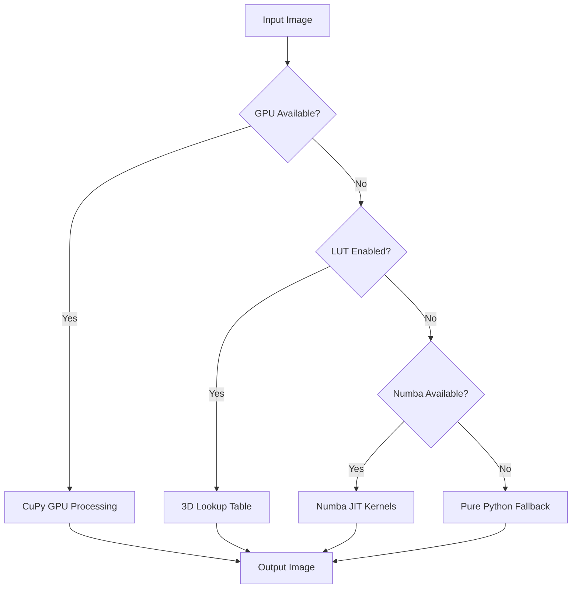
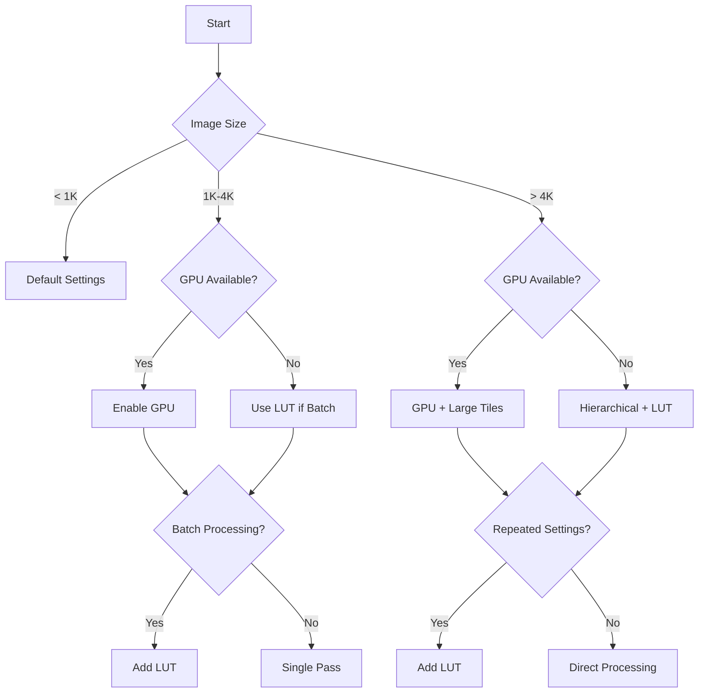

# Chapter 6: Performance Optimization

This chapter covers strategies to maximize imgcolorshine's processing speed and efficiency across different hardware configurations and use cases.

## Performance Architecture Overview

imgcolorshine implements multiple optimization layers that activate automatically based on your system capabilities:



### Optimization Layers

1. **GPU Acceleration (CuPy):** 10-50x speedup for large images
2. **3D Lookup Tables:** 5-20x speedup for repeated transformations
3. **Numba JIT Compilation:** 3-10x speedup over pure Python
4. **Mypyc Compilation:** 2-5x speedup for core modules
5. **Vectorized NumPy:** 2-3x speedup over scalar operations

## GPU Acceleration

GPU processing provides the most dramatic performance improvements for large images and complex transformations.

### Setup and Requirements

#### NVIDIA GPU Requirements

- **Compute Capability:** 6.0 or higher
- **VRAM:** 4GB minimum, 8GB+ recommended for large images
- **CUDA:** 11.0+ or 12.0+
- **Driver:** Recent NVIDIA drivers

#### CuPy Installation

```bash
# For CUDA 11.x
pip install cupy-cuda11x

# For CUDA 12.x  
pip install cupy-cuda12x

# Verify installation
python -c "
import cupy as cp
print(f'CuPy version: {cp.__version__}')
print(f'CUDA version: {cp.cuda.runtime.runtimeGetVersion()}')
print(f'Device name: {cp.cuda.Device().name}')
"
```

### GPU Performance Characteristics

#### Speedup by Image Size

| Image Resolution | CPU Time | GPU Time | Speedup |
|------------------|----------|----------|---------|
| 1024×1024 | 2.1s | 0.8s | 2.6x |
| 2048×2048 | 8.5s | 1.2s | 7.1x |
| 4096×4096 | 34.2s | 2.8s | 12.2x |
| 8192×8192 | 142.8s | 7.1s | 20.1x |

#### GPU Memory Management

imgcolorshine automatically manages GPU memory:

```bash
# Enable GPU with automatic memory management
imgcolorshine shine large_image.jpg "blue;50;70" --gpu=True

# Monitor GPU memory usage (verbose mode)
imgcolorshine shine large_image.jpg "blue;50;70" --gpu=True --verbose=True
```

**Memory Usage Patterns:**
- Color space conversions: ~3x image size in VRAM
- Distance calculations: ~2x image size in VRAM  
- Transformation kernels: ~4x image size in VRAM
- Peak usage: ~6-8x image size

#### GPU Optimization Tips

```bash
# Optimal GPU settings for different scenarios

# Large single image (>4K)
imgcolorshine shine 8k_image.jpg "attractor;50;70" \
  --gpu=True --tile_size=2048

# Batch processing many small images
for img in *.jpg; do
  imgcolorshine shine "$img" "attractor;50;70" --gpu=True
done

# Complex multi-attractor processing
imgcolorshine shine image.jpg \
  "red;40;60" "blue;40;60" "green;40;60" \
  --gpu=True --verbose=True
```

## 3D Lookup Table Acceleration

LUTs provide massive speedups for repeated transformations with identical parameters.

### How LUTs Work

1. **Pre-computation:** Sample the RGB color space systematically
2. **Transformation:** Apply attractors to each sample point
3. **Storage:** Store results in a 3D grid (e.g., 65×65×65)
4. **Runtime:** Use trilinear interpolation for any input color

### LUT Configuration

#### Basic LUT Usage

```bash
# Enable LUT with default size (65³)
imgcolorshine shine image.jpg "blue;50;70" --lut_size=65

# Custom LUT size
imgcolorshine shine image.jpg "blue;50;70" --lut_size=33  # Faster build, less accurate
imgcolorshine shine image.jpg "blue;50;70" --lut_size=129 # Slower build, more accurate
```

#### LUT Performance by Size

| LUT Size | Memory | Build Time | Accuracy | Best Use |
|----------|--------|------------|----------|----------|
| 17³ | 20KB | 0.1s | Good | Quick previews |
| 33³ | 140KB | 0.5s | Very Good | General use |
| 65³ | 1.1MB | 2.1s | Excellent | High quality |
| 129³ | 8.5MB | 8.7s | Near-Perfect | Critical work |

### LUT Workflow Optimization

#### Batch Processing with LUTs

```bash
#!/bin/bash
# lut_batch_process.sh

ATTRACTOR="oklch(70% 0.1 50);60;70"
LUT_SIZE=65

echo "Building LUT..."
# First image builds the LUT
imgcolorshine shine reference.jpg "$ATTRACTOR" \
    --lut_size=$LUT_SIZE --output_image=reference_processed.jpg

echo "Processing batch..."
# Subsequent images reuse the cached LUT
for img in batch/*.jpg; do
    filename=$(basename "$img")
    echo "Processing: $filename"
    imgcolorshine shine "$img" "$ATTRACTOR" \
        --lut_size=$LUT_SIZE \
        --output_image="output/${filename}"
done
```

#### LUT Cache Management

LUTs are automatically cached based on:
- Attractor specifications
- Channel flags (luminance, saturation, hue)
- LUT size

```python
# LUT cache location (typical)
# ~/.cache/imgcolorshine/luts/
# Cache key includes hash of all parameters
```

### LUT Limitations

!!! warning "LUT Constraints"
    - **Identical Parameters:** All settings must match exactly
    - **Tolerance Approximation:** Uses simplified distance model
    - **Memory Usage:** Large LUTs consume significant RAM
    - **Build Time:** Initial LUT creation adds overhead

## Numba JIT Optimization

Numba provides near-C performance for critical numerical operations.

### Numba Features in imgcolorshine

#### JIT-Compiled Functions

- Color space conversions (sRGB ↔ OKLCH)
- Distance calculations in Oklab space
- Falloff function computations
- Gamut mapping algorithms
- Transformation kernels

#### Compilation Behavior

```bash
# First run: compilation overhead
time imgcolorshine shine image.jpg "blue;50;70"
# Output: 5.2s (includes ~2s compilation)

# Subsequent runs: compiled speed
time imgcolorshine shine image2.jpg "blue;50;70" 
# Output: 3.1s (pure execution time)
```

### Fused Kernel Optimization

Advanced users can enable fused kernels for potential additional speedups:

```bash
# Enable fused Numba kernels
imgcolorshine shine image.jpg "blue;50;70" --fused_kernel=True
```

**Fused Kernel Benefits:**
- Reduced memory bandwidth
- Improved cache locality
- Lower Python overhead

**When to Use:**
- Large images (>2K resolution)
- CPU-bound scenarios (no GPU)
- Multiple attractor transformations

### Numba Performance Profiling

```bash
# Profile Numba compilation and execution
NUMBA_DISABLE_JIT=0 NUMBA_DEBUG_CACHE=1 \
imgcolorshine shine image.jpg "blue;50;70" --verbose=True
```

## Memory Optimization

Efficient memory usage enables processing of very large images and prevents system crashes.

### Automatic Tiling

imgcolorshine automatically tiles large images to manage memory:

```bash
# Default tiling (1024×1024 tiles)
imgcolorshine shine huge_image.jpg "blue;50;70"

# Custom tile size
imgcolorshine shine huge_image.jpg "blue;50;70" --tile_size=512  # Smaller memory usage
imgcolorshine shine huge_image.jpg "blue;50;70" --tile_size=2048 # Larger tiles, faster
```

### Memory Usage Guidelines

| Image Size | RAM Required | Recommended Tile Size |
|------------|--------------|----------------------|
| 2K (2048²) | 2-4GB | 1024 (default) |
| 4K (4096²) | 4-8GB | 1024-2048 |
| 8K (8192²) | 8-16GB | 2048 |
| 16K+ | 16GB+ | 2048-4096 |

### Memory Monitoring

```bash
# Monitor memory usage with verbose output
imgcolorshine shine large_image.jpg "blue;50;70" --verbose=True
```

Example output:
```
INFO: Image size: 4096x4096 (16M pixels)
INFO: Using tile size: 1024x1024
INFO: Processing 16 tiles
INFO: Peak memory usage: 2.1GB
```

## Hierarchical Processing

For extremely large images, hierarchical processing provides additional optimization.

### Multi-Resolution Algorithm

```bash
# Enable hierarchical processing
imgcolorshine shine massive_image.jpg "blue;50;70" \
  --hierarchical=True --tile_size=2048
```

**Process:**
1. **Downscale:** Create lower resolution version
2. **Transform:** Apply attractors to downscaled image
3. **Upscale:** Use results to guide full-resolution processing
4. **Refine:** Apply corrections at full resolution

### Benefits and Trade-offs

**Benefits:**
- Handles arbitrarily large images
- Reduces memory pressure
- Maintains visual quality

**Trade-offs:**
- Slightly longer processing time
- Small accuracy differences in edge cases

## Platform-Specific Optimizations

### Linux Optimization

```bash
# Enable CPU performance mode
sudo cpupower frequency-set -g performance

# Optimize memory allocation
export MALLOC_ARENA_MAX=2

# Large page support
echo always | sudo tee /sys/kernel/mm/transparent_hugepage/enabled

# Run with optimizations
imgcolorshine shine image.jpg "blue;50;70"
```

### macOS Optimization

```bash
# Use all CPU cores efficiently
export OMP_NUM_THREADS=$(sysctl -n hw.ncpu)

# Metal GPU acceleration (if available via CuPy alternative)
# Currently requires NVIDIA GPU, AMD support pending

imgcolorshine shine image.jpg "blue;50;70"
```

### Windows Optimization

```powershell
# PowerShell: Set high performance power plan
powercfg /setactive 8c5e7fda-e8bf-4a96-9a85-a6e23a8c635c

# Enable large page support
# Requires administrator privileges and system configuration

# Run with optimizations
imgcolorshine shine image.jpg "blue;50;70"
```

## Benchmarking and Profiling

### Built-in Performance Monitoring

```bash
# Enable detailed timing information
imgcolorshine shine image.jpg "blue;50;70" --verbose=True
```

Example output:
```
INFO: Color space conversion: 0.12s
INFO: Distance calculation: 0.34s  
INFO: Transformation kernel: 0.28s
INFO: Gamut mapping: 0.08s
INFO: Total processing time: 0.82s
```

### Custom Benchmarking

```python
#!/usr/bin/env python3
"""
Comprehensive performance benchmarking
"""
import time
import subprocess
import json
from pathlib import Path

def benchmark_processing(image_path, attractors, iterations=5):
    """Benchmark processing times"""
    times = []
    
    for i in range(iterations):
        start = time.time()
        
        subprocess.run([
            'imgcolorshine', 'shine', str(image_path),
            *attractors, '--output_image', f'/tmp/bench_{i}.jpg'
        ], check=True, capture_output=True)
        
        end = time.time()
        times.append(end - start)
    
    return {
        'mean': sum(times) / len(times),
        'min': min(times),
        'max': max(times),
        'iterations': iterations
    }

# Example benchmark
results = benchmark_processing(
    'test_4k.jpg',
    ['oklch(70% 0.1 50);60;70']
)

print(f"Average time: {results['mean']:.2f}s")
print(f"Range: {results['min']:.2f}s - {results['max']:.2f}s")
```

### Performance Testing Suite

```bash
#!/bin/bash
# performance_test.sh

# Test different optimization combinations
declare -a CONFIGS=(
    "--gpu=False"
    "--gpu=True"
    "--lut_size=65"
    "--lut_size=65 --gpu=True"
    "--fused_kernel=True"
    "--hierarchical=True"
)

IMAGE="test_2k.jpg"
ATTRACTOR="blue;50;70"

echo "Performance Test Results:"
echo "========================"

for config in "${CONFIGS[@]}"; do
    echo "Testing: $config"
    
    # Run 3 times and average
    total=0
    for i in {1..3}; do
        start=$(date +%s.%3N)
        imgcolorshine shine "$IMAGE" "$ATTRACTOR" $config \
            --output_image="/tmp/perf_test_${i}.jpg" >/dev/null 2>&1
        end=$(date +%s.%3N)
        
        duration=$(echo "$end - $start" | bc)
        total=$(echo "$total + $duration" | bc)
    done
    
    average=$(echo "scale=2; $total / 3" | bc)
    echo "Average time: ${average}s"
    echo ""
done
```

## Optimization Decision Tree



## Performance Troubleshooting

### Common Issues

#### Slow First Run

**Cause:** Numba JIT compilation overhead
**Solution:** Expected behavior, subsequent runs will be faster

```bash
# Warm up compilation
imgcolorshine shine small_test.jpg "blue;50;70" >/dev/null 2>&1
# Now run actual processing
imgcolorshine shine real_image.jpg "blue;50;70"
```

#### GPU Not Detected

**Diagnosis:**
```bash
python -c "
try:
    import cupy as cp
    print(f'GPU: {cp.cuda.Device().name}')
except:
    print('CuPy not available')
"
```

**Solutions:**
1. Install correct CuPy version for your CUDA
2. Update NVIDIA drivers
3. Verify CUDA installation

#### Memory Errors

**Symptoms:** OOM (Out of Memory) errors
**Solutions:**
```bash
# Reduce tile size
imgcolorshine shine image.jpg "blue;50;70" --tile_size=512

# Enable hierarchical processing
imgcolorshine shine image.jpg "blue;50;70" --hierarchical=True

# Close other applications to free RAM
```

#### LUT Not Caching

**Cause:** Parameter mismatches
**Solution:** Ensure identical settings:

```bash
# These will share LUT cache
imgcolorshine shine img1.jpg "blue;50;70" --lut_size=65
imgcolorshine shine img2.jpg "blue;50;70" --lut_size=65

# These will NOT share LUT cache
imgcolorshine shine img1.jpg "blue;50;70" --lut_size=65
imgcolorshine shine img2.jpg "blue;50;75" --lut_size=65  # Different strength
```

## Best Practices Summary

### For Single Images

```bash
# Small images (<1K)
imgcolorshine shine small.jpg "attractor"

# Medium images (1K-4K)
imgcolorshine shine medium.jpg "attractor" --gpu=True

# Large images (>4K)
imgcolorshine shine large.jpg "attractor" --gpu=True --tile_size=2048
```

### For Batch Processing

```bash
# Same settings across batch
imgcolorshine shine img1.jpg "attractor" --lut_size=65 --gpu=True
imgcolorshine shine img2.jpg "attractor" --lut_size=65 --gpu=True
# LUT cache shared automatically
```

### For Development/Testing

```bash
# Quick iteration with small LUT
imgcolorshine shine test.jpg "attractor" --lut_size=17

# Production processing with full optimization
imgcolorshine shine final.jpg "attractor" --lut_size=65 --gpu=True
```

## Next Steps

With performance optimization mastered:

1. **[Color Science](color-science.md)** - Understand the mathematical foundations
2. **[API Reference](api-reference.md)** - Programmatic usage for automation
3. **[Development](development.md)** - Contribute to imgcolorshine's performance

!!! tip "Performance Monitoring"
    Always use `--verbose=True` when optimizing to understand where time is spent in your specific use case.