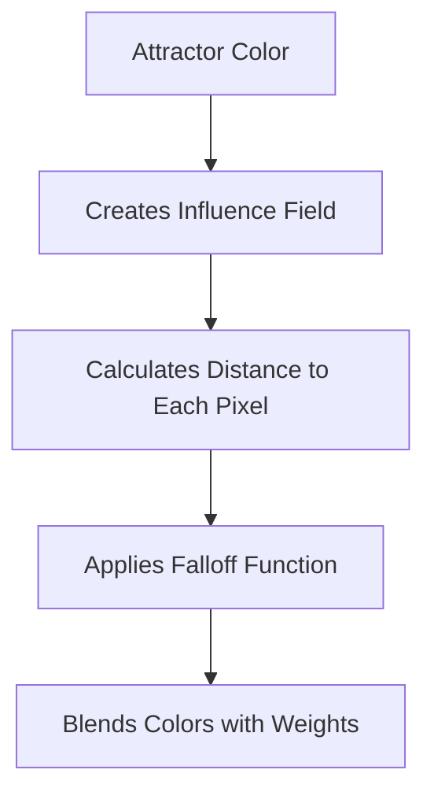

# Chapter 4: Understanding Attractors

This chapter provides a deep technical understanding of the attractor model that powers imgcolorshine's unique approach to color transformation.

## The Physics-Inspired Model

imgcolorshine's attractor system is inspired by gravitational physics, where colors are pulled through perceptually uniform color space rather than replaced.

### Gravitational Analogy

In physics, gravity follows an inverse square law where force decreases with distance. imgcolorshine adapts this concept:



**Key Differences from Physics:**
- Uses raised cosine falloff instead of inverse square
- Distance measured in perceptually uniform OKLCH space
- Tolerance creates adaptive field boundaries
- Multiple attractors can overlap and blend

### Why This Model Works

1. **Natural Transitions:** Mimics how we perceive color relationships
2. **Preserves Harmony:** Maintains existing color relationships
3. **Adaptive Behavior:** Responds to image content automatically
4. **Intuitive Control:** Parameters behave predictably

## The Two-Pass Algorithm

imgcolorshine uses a sophisticated two-pass approach for each attractor:

### Pass 1: Tolerance Analysis

The first pass determines the effective radius of influence:

```python
# Simplified algorithm outline
def calculate_tolerance_threshold(image_pixels, attractor_color, tolerance_percent):
    # 1. Convert all pixels and attractor to OKLCH
    attractor_oklab = convert_to_oklab(attractor_color)
    pixel_oklabs = convert_pixels_to_oklab(image_pixels)
    
    # 2. Calculate perceptual distances (Delta E)
    distances = []
    for pixel in pixel_oklabs:
        delta_e = euclidean_distance(pixel, attractor_oklab)
        distances.append(delta_e)
    
    # 3. Find percentile threshold
    threshold = numpy.percentile(distances, tolerance_percent)
    return threshold
```

#### Why Percentile-Based?

Traditional radius-based approaches fail because:
- Same radius affects different amounts of pixels in different images
- No adaptation to image content
- Unpredictable results across diverse images

Percentile-based tolerance ensures:
- Consistent relative influence across all images
- Automatic adaptation to color palette
- Predictable parameter behavior

### Pass 2: Color Transformation

The second pass applies the actual color transformation:

```python
# Simplified transformation algorithm
def transform_pixel(pixel, attractors, channel_flags):
    final_color = pixel.copy()
    total_weight = 0
    
    for attractor in attractors:
        # Calculate influence weight
        distance = calculate_distance(pixel, attractor.color)
        
        if distance <= attractor.threshold:
            # Normalized distance (0 = exact match, 1 = at threshold)
            d_norm = distance / attractor.threshold
            
            # Raised cosine falloff
            falloff = 0.5 * (cos(d_norm * π) + 1.0)
            
            # Apply strength
            if attractor.strength <= 100:
                weight = (attractor.strength / 100.0) * falloff
            else:
                # Extended strength flattens falloff
                base = falloff
                extra = (attractor.strength - 100) / 100.0
                weight = base + extra * (1.0 - base)
            
            total_weight += weight
            
            # Accumulate color influence
            for channel in ['L', 'C', 'H']:
                if channel_flags[channel]:
                    final_color[channel] += weight * attractor.color[channel]
    
    # Normalize and blend with original
    source_weight = max(0, 1 - total_weight)
    final_color = source_weight * pixel + (final_color - pixel)
    
    return final_color
```

## Perceptual Distance in OKLCH Space

The quality of color transformations depends heavily on accurate perceptual distance measurement.

### Why OKLCH/Oklab?

Traditional RGB color spaces fail for perceptual work:

=== "RGB Problems"
    - Non-uniform perceptual distances
    - Euclidean distance doesn't match visual perception
    - Gamma-encoded, not linear
    - Device-dependent

=== "OKLCH Advantages"
    - Perceptually uniform
    - Euclidean distance ≈ visual difference
    - Linear color space
    - Device-independent

### Distance Calculation

In Oklab space, perceptual distance (ΔE) is simply:

```
ΔE = √[(L₁-L₂)² + (a₁-a₂)² + (b₁-b₂)²]
```

This means:
- ΔE = 1.0 is a just-noticeable difference
- ΔE = 5.0 is clearly visible
- ΔE = 10.0+ is a large difference

### Color Space Conversion Pipeline

imgcolorshine performs these conversions:


Each step is carefully calibrated for accuracy.

## Falloff Functions Deep Dive

The falloff function determines how influence decreases with distance from the attractor.

### Raised Cosine Falloff

imgcolorshine uses a raised cosine function:

```
falloff(d) = 0.5 × (cos(d × π) + 1.0)
```

Where `d` is normalized distance (0 to 1).

#### Properties:
- **At d=0 (exact match):** falloff = 1.0 (full influence)
- **At d=0.5 (halfway):** falloff = 0.5 (half influence)  
- **At d=1.0 (threshold):** falloff = 0.0 (no influence)
- **Smooth curve:** No abrupt transitions

### Comparing Falloff Functions

=== "Linear Falloff"
    ```
    falloff(d) = 1.0 - d
    ```
    **Character:** Harsh, unnatural transitions

=== "Quadratic Falloff"
    ```
    falloff(d) = (1.0 - d)²
    ```
    **Character:** Gentle near attractor, rapid dropoff

=== "Raised Cosine (Used)"
    ```
    falloff(d) = 0.5 × (cos(d × π) + 1.0)
    ```
    **Character:** Smooth, natural transitions

### Extended Strength Mode

For strength > 100, the falloff is progressively flattened:

```python
def extended_falloff(d, strength):
    base_falloff = 0.5 * (cos(d * π) + 1.0)
    
    if strength <= 100:
        return (strength / 100.0) * base_falloff
    else:
        base_weight = base_falloff
        extra_factor = (strength - 100.0) / 100.0
        return base_weight + extra_factor * (1.0 - base_weight)
```

At strength = 200, this becomes a flat weight of 1.0 across the entire tolerance radius.

## Multi-Attractor Blending

When multiple attractors influence the same pixel, their effects are combined using weighted averaging.

### Blending Algorithm

```python
def blend_attractors(pixel, attractor_influences):
    # Calculate individual weights
    weights = []
    colors = []
    
    for attractor, influence in attractor_influences:
        weight = calculate_weight(pixel, attractor)
        weights.append(weight)
        colors.append(attractor.color)
    
    # Normalize weights
    total_weight = sum(weights)
    source_weight = max(0.0, 1.0 - total_weight)
    
    # Weighted average
    result = source_weight * pixel.color
    for i, (weight, color) in enumerate(zip(weights, colors)):
        result += weight * color
    
    return result
```

### Hue Blending Special Case

Hue is an angular quantity (0-360°), requiring special circular averaging:

```python
def blend_hues(hues, weights):
    # Convert to cartesian coordinates
    x_sum = sum(weight * cos(radians(hue)) for hue, weight in zip(hues, weights))
    y_sum = sum(weight * sin(radians(hue)) for hue, weight in zip(hues, weights))
    
    # Convert back to angle
    blended_hue = degrees(atan2(y_sum, x_sum))
    if blended_hue < 0:
        blended_hue += 360
        
    return blended_hue
```

This ensures that blending red (0°) and blue (240°) produces purple (~300°), not green (~120°).

## Tolerance Adaptation Examples

Understanding how tolerance adapts to different image types:

### High Dynamic Range Image

Image with colors spread across the full spectrum:
```bash
imgcolorshine shine hdr_landscape.jpg "blue;50;70"
```

- 50% tolerance might correspond to ΔE ≈ 15-20
- Only relatively blue pixels are affected
- Natural, selective enhancement

### Monochromatic Image

Image with limited color palette:
```bash
imgcolorshine shine sepia_portrait.jpg "blue;50;70" 
```

- 50% tolerance might correspond to ΔE ≈ 5-8
- Half the pixels affected despite being "far" from blue
- Dramatic transformation potential

### Saturated Commercial Image

Image with vibrant, saturated colors:
```bash
imgcolorshine shine advertisement.jpg "blue;50;70"
```

- 50% tolerance might correspond to ΔE ≈ 25-30
- Clear selection of blue-ish areas
- Preserves existing vibrancy

## Advanced Attractor Strategies

### Complementary Attractor Pairs

Use color theory for dramatic effects:

```bash
# Orange/Teal cinematic look
imgcolorshine shine movie_frame.jpg \
  "oklch(75% 0.15 50);40;60" \    # Orange for warm areas
  "oklch(50% 0.15 200);40;60"     # Teal for cool areas
```

### Triadic Color Schemes

Three attractors at 120° intervals:

```bash
imgcolorshine shine creative_shot.jpg \
  "oklch(70% 0.2 0);30;50" \      # Red
  "oklch(70% 0.2 120);30;50" \    # Green  
  "oklch(70% 0.2 240);30;50"      # Blue
```

### Analogous Color Progressions

Similar colors for subtle shifts:

```bash
imgcolorshine shine sunset.jpg \
  "oklch(80% 0.15 30);40;60" \    # Orange
  "oklch(85% 0.12 50);35;55" \    # Yellow-orange
  "oklch(75% 0.18 10);45;65"      # Red-orange
```

## Tolerance Tuning Guidelines

### Based on Image Characteristics

=== "High Contrast Images"
    - Use lower tolerance (30-50)
    - Distinct color regions
    - Precise selection needed

=== "Low Contrast Images"  
    - Use higher tolerance (60-80)
    - Subtle color variations
    - Broader influence desired

=== "Monochromatic Images"
    - Use very high tolerance (70-90)
    - Limited color palette
    - Dramatic transformation possible

### Based on Desired Effect

=== "Color Correction"
    - Tolerance: 20-40
    - Strength: 40-70
    - Precise, natural adjustments

=== "Color Grading"
    - Tolerance: 40-70
    - Strength: 50-90
    - Balanced artistic look

=== "Artistic Stylization"
    - Tolerance: 60-90
    - Strength: 80-150
    - Dramatic transformation

## Mathematical Properties

### Commutative Property

The order of attractors doesn't matter:
```bash
# These produce identical results
imgcolorshine shine image.jpg "red;50;70" "blue;60;80"
imgcolorshine shine image.jpg "blue;60;80" "red;50;70"
```

### Associative Blending

Multiple attractors blend associatively:
```
(A + B) + C = A + (B + C)
```

### Weight Conservation

Total influence weights are normalized:
```
Source_Weight + Attractor_Weight₁ + Attractor_Weight₂ + ... = 1.0
```

## Debugging Attractor Behavior

### Verbose Mode Analysis

Enable detailed logging to understand decisions:

```bash
imgcolorshine shine image.jpg "blue;50;70" --verbose=True
```

This reveals:
- Calculated tolerance thresholds
- Number of affected pixels
- Processing timing
- Color space conversions

### Systematic Testing

Test parameter ranges to understand behavior:

```bash
# Test tolerance range
for t in 20 40 60 80; do
  imgcolorshine shine test.jpg "blue;${t};70" --output_image="tol_${t}.jpg"
done

# Test strength range  
for s in 30 60 90 120; do
  imgcolorshine shine test.jpg "blue;50;${s}" --output_image="str_${s}.jpg"
done
```

### Channel Isolation

Test each channel separately:

```bash
# Test lightness only
imgcolorshine shine test.jpg "white;60;80" \
  --saturation=False --hue=False --output_image=lightness_only.jpg

# Test chroma only
imgcolorshine shine test.jpg "red;60;80" \
  --luminance=False --hue=False --output_image=chroma_only.jpg

# Test hue only
imgcolorshine shine test.jpg "blue;60;80" \
  --luminance=False --saturation=False --output_image=hue_only.jpg
```

## Common Misconceptions

### ❌ "Tolerance is a fixed radius"
Tolerance is adaptive and percentile-based, not a fixed distance.

### ❌ "Higher strength always means more dramatic"
Higher strength can actually create more uniform, less natural effects.

### ❌ "RGB distance is good enough"
RGB Euclidean distance doesn't match perceptual differences.

### ❌ "Order of attractors matters"
Attractor blending is commutative - order doesn't affect results.

### ❌ "More attractors always mean better results"
Too many attractors can create muddy, conflicting effects.

## Next Steps

With deep attractor understanding:

1. **[Advanced Features](advanced-features.md)** - Complex multi-attractor techniques
2. **[Performance Optimization](performance-optimization.md)** - Speed up processing
3. **[Color Science](color-science.md)** - Mathematical foundations

!!! tip "Experimentation Tip"
    Create a test image with distinct color patches (red, green, blue, etc.) and experiment with different attractor parameters to see the effects clearly.